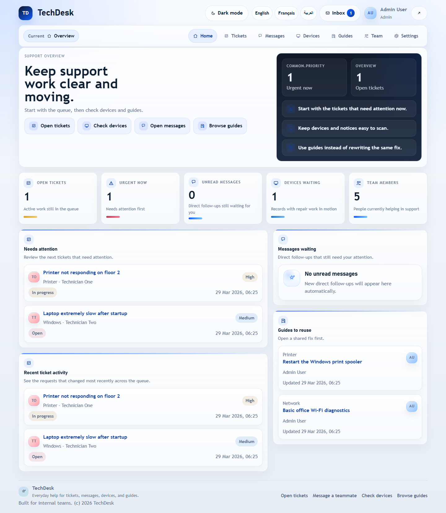
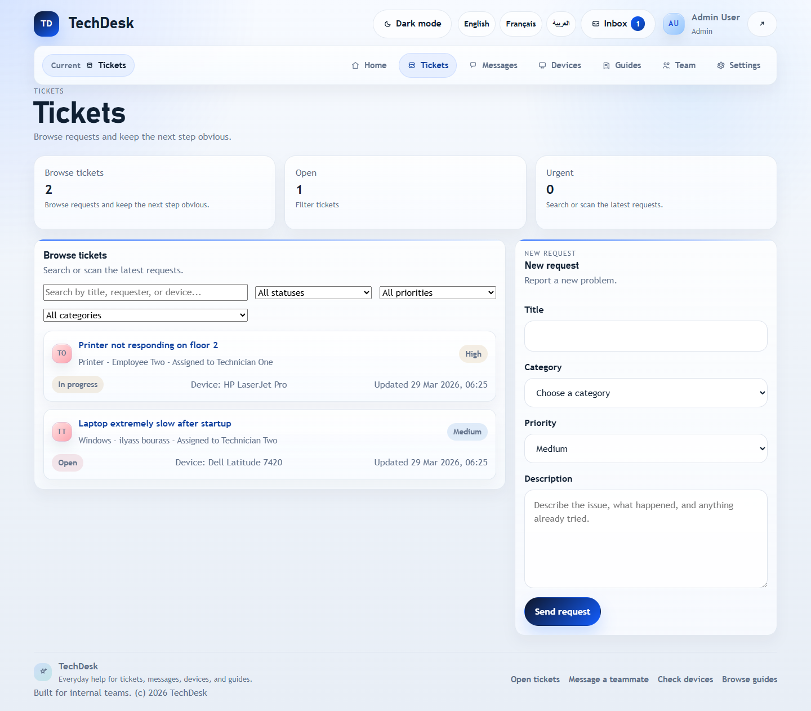
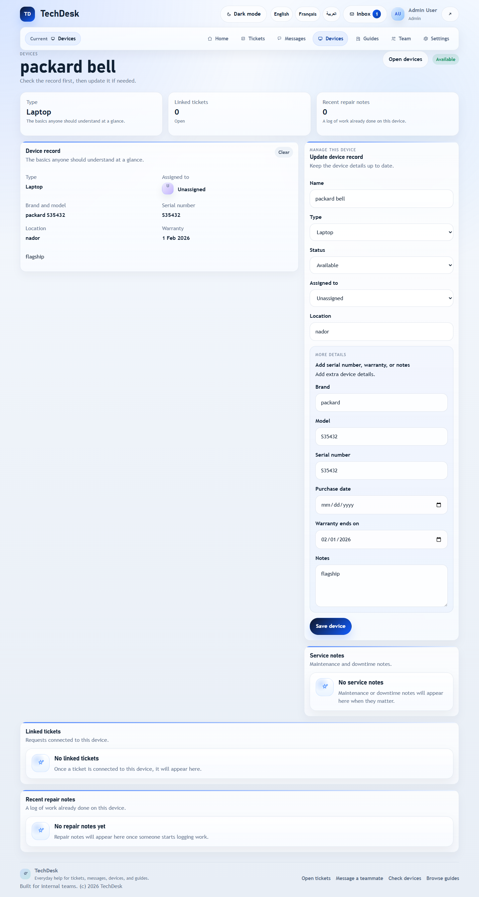
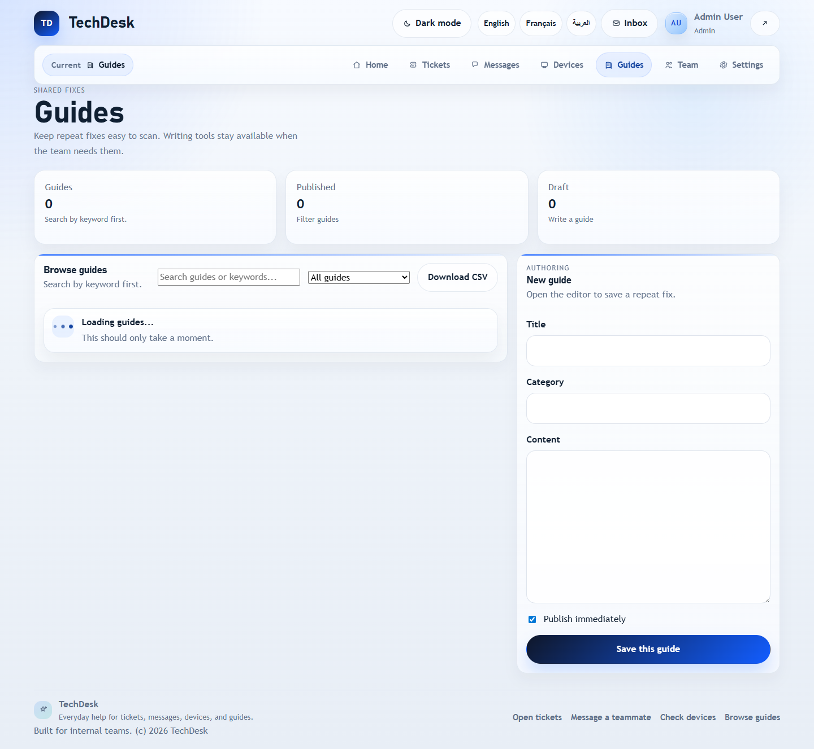
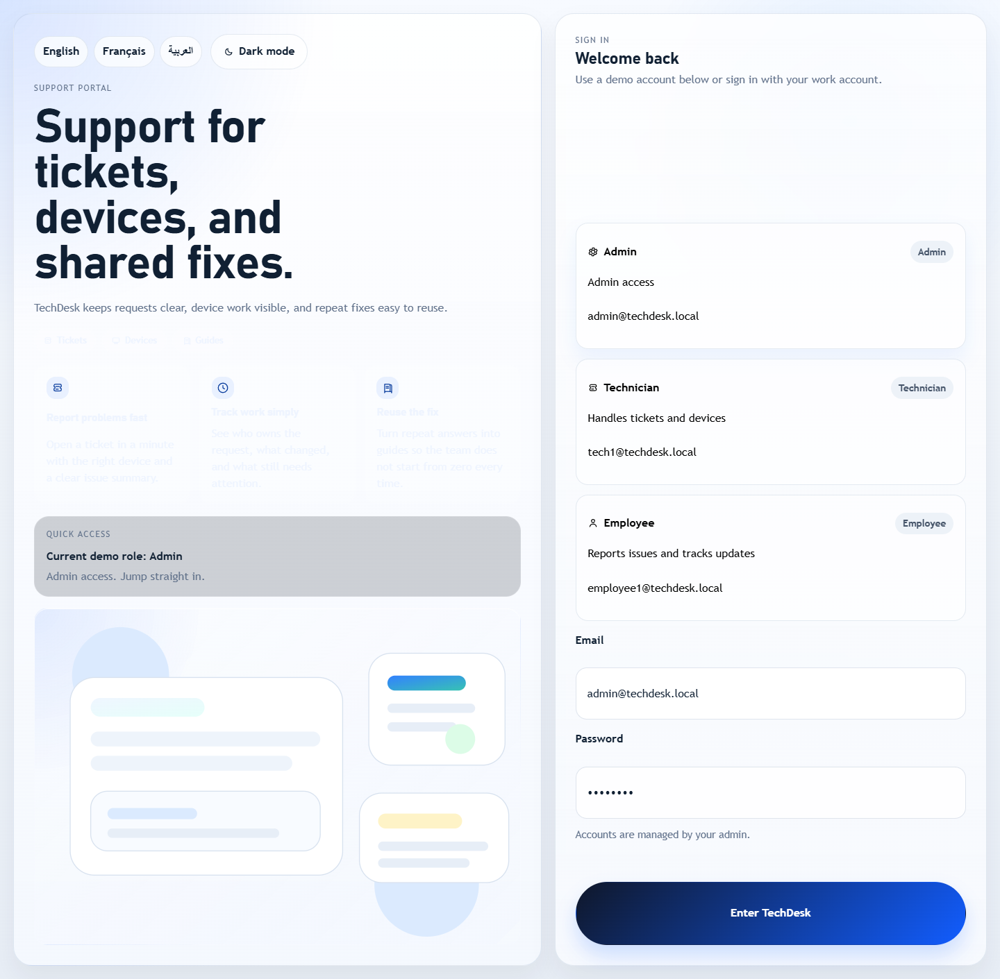

# TechDesk

TechDesk is a full-stack IT support and asset management platform built for internal operations teams. It combines ticketing, device tracking, knowledge sharing, realtime messaging, reporting, and role-based workflows in one product.

## Live Demo

Add your production demo link here once the site is deployed:

```text
https://your-techdesk-domain.example
```

## Source Code

The production source code for TechDesk is private.

- public showcase repo: product overview, screenshots, and portfolio material
- private source repo: application code, infrastructure setup, and internal implementation details

This repository does not contain the full application source.

## What TechDesk Covers

- support ticket creation, triage, SLA tracking, approvals, and escalations
- asset inventory, assignment tracking, maintenance, and replacement planning
- realtime direct messaging and notification flows for support teams
- internal knowledge base with guide authoring and image support
- reporting, CSV exports, and dashboard views for operational follow-up
- role-aware experiences for admin, technician, and employee users

## Stack

- Laravel
- React
- Vite
- Reverb / WebSockets
- SQLite for local development
- Docker deployment scaffolding

## Screenshots

### Admin home



### Ticket operations



### Asset detail



### Knowledge base



### Login



## Portfolio Summary

TechDesk was built as a production-style internal support platform, not just a CRUD demo. The product focuses on operational workflows: ticket queues, evidence handling, realtime messaging, asset lifecycle tracking, maintenance, procurement awareness, and role-specific dashboards.

## CV Copy

- Built TechDesk, a full-stack IT support and asset management platform with Laravel and React.
- Implemented ticketing, role-based dashboards, realtime messaging, notifications, knowledge base workflows, and export/reporting features.
- Added asset lifecycle tracking, maintenance planning, and operational support tooling for admin, technician, and employee roles.

## Contact

If you are reviewing this project for hiring, freelance, or collaboration purposes, the live demo and additional walkthrough material can be shared directly.
